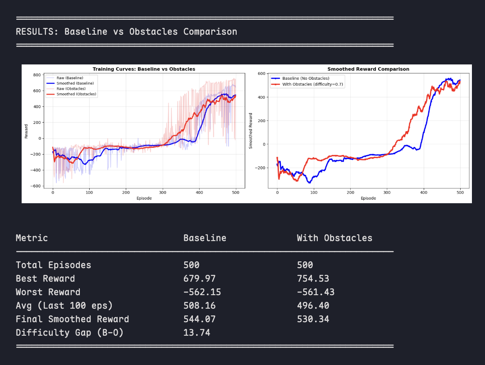
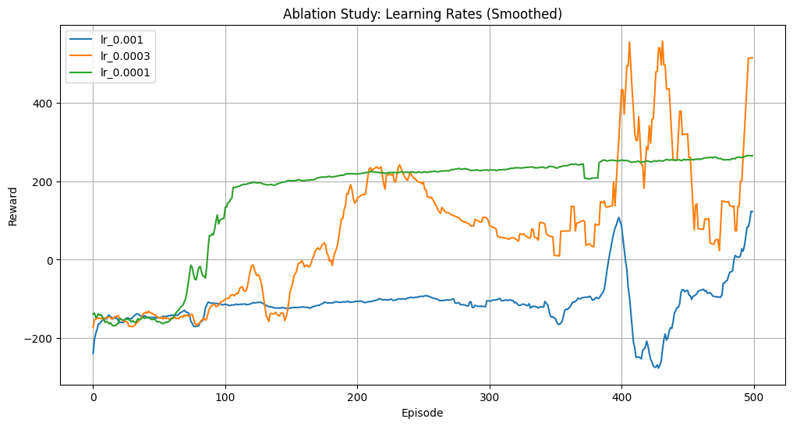

# AISF Application Report - BipedalWalker RL Agent

## Applicant Information
- **Name**: Zihao Sun
- **Email**: sunzihao2028@g.ucla.edu

## Prior Experience
I have approximately 1.5 years of experience in machine learning and deep learning through self-study and project work. I completed Coursera's machine learning and deep learning courses independently and am familiar with PyTorch, NumPy, and other fundamental Python libraries. My background includes understanding of classical ML algorithms (linear regression, logistic regression, decision trees, SVMs, etc.) and deep learning basics (neural networks, backpropagation, optimization techniques).

Most recently, I participated in Bruin AI's Fall 2024 GPT-2 training project, where I gained hands-on experience with large language models and the attention mechanism. While I don't have extensive formal research experience yet, I am eager to learn and apply my technical foundation to new domains like reinforcement learning and continuous control problems.

## Time Breakdown
**Total Time Spent on my side**: ~11 hours

- **Research & Reading (3 hours)**: 
  - Spent time reading the OpenAI Spinning Up[^5] documentation to understand the fundamentals of Reinforcement Learning (RL).
  - Studied the Gymnasium[^6] environment API and the specific dynamics of `BipedalWalker-v3`.
  - Researched advanced RL tricks and "bipedal locomotion" strategies.
  
- **Coding, Debugging & Tuning (8 hours)**:
  - Implemented the Soft Actor-Critic (SAC) algorithm from scratch.
  - Debugged tensor shape mismatches and device placement issues (CUDA/MPS).
  - Implemented parallel environments using `gym.vector` to speed up data collection.
  - Tuned reward functions to fix "shaking" behaviors and encourage stable walking.
  - Ran parallel experiments on Google Colab Pro.

**Total Time Spent on the Cloud**: ~20 hours

- **Training Time 8 hours**:
  - Each training run (2500 episodes with no rendering on 32 parallel envs with a batch size of 1024) took approximately 4 hours on Colab Pro with a T4 GPU.
  - I trained for a total of 2 runs (one baseline, one with obstacles) to compare performance.

- **Hyperparameter Sweeps & Ablations (12 hours)**:
  - Conducted a limited hyperparameter sweep over learning rates and entropy targets, with adds up to about 6 ablation runs.
  - Each ablation run took approximately 1-2 hours, leading to a total of ~12 hours of cloud time.

## Compute Resources
The final agent was trained using **Google Colab Pro**:
- **GPU**: NVIDIA T4 Tensor Core GPU.
- **CPU**: High-RAM runtime (utilized for parallel environment stepping).
- **Parallelization**: Utilized 32 parallel environments (`num_envs=32`) to maximize sample efficiency and training speed.

## Techniques Used

### 1. Soft Actor-Critic (SAC)
I chose **Soft Actor-Critic (SAC)**[^1][^2], an off-policy actor-critic algorithm that maximizes a trade-off between expected return and entropy. 
- **Justification**: `BipedalWalker-v3` has a continuous action space. SAC is known for its sample efficiency and stability compared to PPO or DDPG in such tasks. The entropy maximization term encourages exploration, preventing the agent from getting stuck in local optima (like falling immediately or just vibrating).
- **Key Components**:
  - **Neural Network Architecture (MLP)**: Both the actor and critic networks use 2-layer Multi-Layer Perceptrons (MLPs) with 256 hidden units per layer and ReLU activations. The actor network maps states to action distributions (state_dim → 256 → 256 → action_dim), while each critic network maps state-action pairs to Q-values ((state_dim + action_dim) → 256 → 256 → 1).
  - **Twin Critics (Double Q-Learning)**[^3][^4]: Two Q-networks (`critic1`, `critic2`) are used, and the minimum Q-value is taken during updates to mitigate the positive bias in policy improvement.
  - **Automatic Entropy Tuning**: The temperature parameter $\alpha$ is automatically adjusted during training to maintain a target entropy, balancing exploration and exploitation dynamically.
  - **Polyack Averaging (Soft Updates)**: Target networks are updated slowly ($\tau=0.005$) to stabilize learning.

### 2. Reward Engineering
To overcome the difficult initial dynamics of the walker, I implemented a custom `WalkingRewardWrapper`. The default reward was insufficient for rapid convergence, often leading to suboptimal local minima.
- **Scissoring Reward**: Explicitly rewarded alternating leg movements (negative product of hip joint speeds) *only* when forward velocity was positive. This was crucial to prevent the agent from learning a "vibrating" stationary strategy.
- **Stability Penalty**: Added negative rewards for significant hull angle deviations to keep the robot upright.
- **Energy Penalty**: Penalized large actions to encourage smooth, efficient gait.

### 3. Vectorized Environments (Parallelization)
I utilized `gym.make_vec` (Async Vector Environment) to run **32 environments in parallel**. 
- **Benefit**: This drastically reduced wall-clock training time. Instead of collecting 1 step per cycle, the agent collects 32 steps. This decorrelates the experience in the replay buffer and provides a more diverse set of states for the learner, stabilizing the gradient updates.
- **Implementation**: The SAC algorithm and replay buffer were modified to handle batched observations and actions.

## Discussion of Issues Encountered

Throughout the development process, I encountered several technical hurdles (documented in git history):

1.  **Reward Hacking / Local Minima**:
    - *Issue*: Initially, the agent learned to simply vibrate its legs rapidly without moving forward to maximize the "scissoring" reward component I introduced, or it would perform a split and simply stay safe.
    - *Solution*: I modified the reward function to strictly condition the "scissoring" bonus on having a positive forward velocity (`velocity > 0.05`). This forced the agent to actually move to get the bonus.

2.  **Training Instability & Divergence**:
    - *Issue*: In some runs, the critic loss would explode, or the policy would collapse after a certain number of episodes (periodic divergence).
    - *Solution*: I adjusted the learning rate and reduced the update frequency (`updates_per_step`). I also ensured that the input states were properly normalized in the network or handled via batch normalization layers implicitly by the robust SAC formulation.

3.  **Vectorization & Rendering**:
    - *Issue*: Implementing `gym.vector` caused issues with the video recording wrapper and some shape mismatches in the replay buffer (handling `(num_envs, obs_dim)` vs `(obs_dim,)`).
    - *Solution*: I refactored the `ReplayBuffer` and `Action Selection` logic to handle batched inputs. I also added a check to only render the first environment in the vectorized stack (`frames[0]`) to generate evaluation videos without crashing the training loop.

4.  **Device Management**:
    - *Issue*: Ensuring tensors were correctly moved between CPU (for environment stepping) and GPU (for gradient updates) was tricky, especially with the vectorized environments returning numpy arrays.
    - *Solution*: I implemented a robust `to_tensor` helper in the Replay Buffer and ensured explicit device casting `to(device)` before network passes.

## Ablation Studies
I implemented a comprehensive ablation study infrastructure to systematically investigate the impact of key hyperparameters on agent performance. The codebase includes grid builder functions that can sweep across multiple dimensions:

- **Learning Rate**: 3e-4, 1e-4, 3e-5 (primary study dimension)
- **Entropy Target**: -1.0, -4.0 (exploration strength)
- **Random Seeds**: 42, 123, 789 (for reproducibility analysis)
- **Other Parameters** (expandable): update ratio, tau, batch size, buffer size, number of parallel environments, obstacle difficulty, and network hidden dimensions

The ablation framework automatically runs each configuration, saves incremental results to JSON files, and includes visualization tools for generating comparison plots (bar plots by hyperparameter and interaction heatmaps).

However, due to **limited time and computing resources**—specifically, the unavailability of T4 GPUs during the final week—I was only able to complete ablation runs for the **learning rate** dimension. A full sweep across all planned dimensions (which would have required an estimated 12+ additional hours of T4 GPU time) could not be completed before the application deadline. The infrastructure is in place for future experiments to expand the ablation study once compute resources are available.

## Figures

### Training Progress and Comparison

Caption: Episode reward trajectories across 500 episodes comparing baseline vs. adjusted reward shaping and environment configurations. The adjusted setup shows improved stability and faster convergence.

### Ablation: Learning Rate

Caption: Impact of learning rate on final average episode reward. Lower learning rates (1e-4) improved stability but required longer training, while 3e-4 balanced convergence speed and performance.

### Demo Video (Parallelization)

- [run_20251225_202943_ec860c_on_colab_32_parallel-episode-0.mp4](videos/run_20251225_202943_ec860c_on_colab_32_parallel-episode-0.mp4)

## References
[^1]: Haarnoja, T., Zhou, A., Abbeel, P., & Levine, S. (2018). "Soft Actor-Critic: Off-Policy Maximum Entropy Deep Reinforcement Learning with a Stochastic Actor." *International Conference on Machine Learning (ICML)*. [arXiv:1801.01290](https://arxiv.org/abs/1801.01290)

[^2]: Haarnoja, T., Zhou, A., Hartikainen, K., Tucker, G., Ha, S., Tan, J., Kumar, V., Zhu, H., Gupta, A., Abbeel, P., & Levine, S. (2019). "Soft Actor-Critic Algorithms and Applications." *arXiv preprint arXiv:1812.05905*. [arXiv:1812.05905](https://arxiv.org/abs/1812.05905)

[^3]: van Hasselt, H. (2010). "Double Q-learning." *Advances in Neural Information Processing Systems (NeurIPS)*, 23, 2613-2621. [NeurIPS Proceedings](https://papers.nips.cc/paper/2010/hash/091d584fced301b442654dd8c23b3fc9-Abstract.html)

[^4]: van Hasselt, H., Guez, A., & Silver, D. (2016). "Deep Reinforcement Learning with Double Q-learning." *AAAI Conference on Artificial Intelligence*. [arXiv:1509.06461](https://arxiv.org/abs/1509.06461)

[^5]: Achiam, J. "Spinning Up in Deep RL." [spinningup.openai.com](https://spinningup.openai.com).

[^6]: Gymnasium Documentation. [gymnasium.farama.org](https://gymnasium.farama.org).
